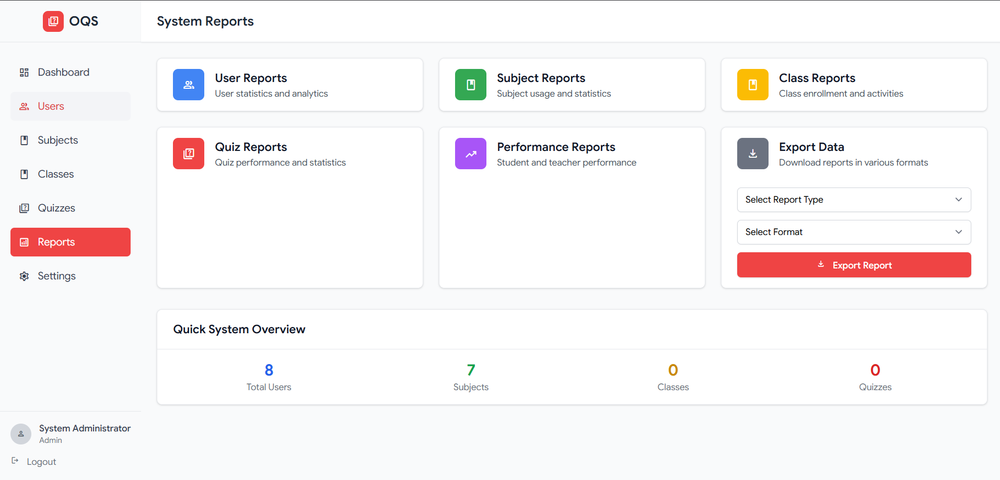

# Online Quiz System (OQS)

A comprehensive role-based educational quiz management platform built with Laravel 12.x, featuring modern Material Design UI and robust functionality for administrators, teachers, and students.


## 🚀 Features

### Role-Based Access Control
- **System Administrator**: Complete system control, user management, academic structure design
- **Teacher/Educator**: Class management, quiz creation, student assessment and grading
- **Student/Learner**: Quiz participation, progress tracking, performance analytics

### Core Functionality
- **Quiz Management**: Multiple question formats (multiple-choice, true/false, short answer)
- **Timed Assessments**: Interactive interface with countdown timer and auto-submit
- **Real-time Analytics**: Performance tracking, progress visualization, detailed reporting
- **Access Control**: Secure 6-digit access codes for quiz entry
- **Responsive Design**: Material Design 3.0 principles with mobile-first approach

### Technical Specifications
- **Backend**: Laravel 12.x with Sanctum authentication
- **Frontend**: Blade templates with Tailwind CSS v3
- **Database**: SQLite (development) / MySQL (production)
- **Design System**: Google Material Design with Google Sans typography
- **Icons**: Material Symbols Light
- **Build Tool**: Vite with Hot Module Replacement

## 🛠️ Installation & Setup

### Prerequisites
- PHP 8.1+
- Composer
- Node.js 16+
- Laravel 12.x

### Quick Start
```bash
# Install PHP dependencies
composer install

# Install Node.js dependencies
npm install

# Set up environment
cp .env.example .env
php artisan key:generate

# Run database migrations and seed
php artisan migrate:fresh --seed

# Start development servers
php artisan serve        # Backend server (http://127.0.0.1:8000)
npm run dev             # Frontend assets
```

### Default Login Credentials
```
Admin:    admin@oqs.com / admin123
Teacher:  teacher@oqs.com / teacher123
Student:  student1@oqs.com / student123
```

## 📊 Database Schema

### Core Tables
- **users** - User accounts with role-based permissions
- **subjects** - Academic subjects with customizable colors/icons
- **classes** - Class management with teacher assignments
- **quizzes** - Quiz configuration and settings
- **questions** - Question bank with multiple formats
- **quiz_attempts** - Student quiz submissions and scoring
- **user_answers** - Individual question responses
- **class_enrollments** - Student-class relationships

## 🎨 UI/UX Design System

### Color Palette (Google Material Design)
- **Primary Red**: #EA4335 (Google Red)
- **Blue**: #4285F4 (Google Blue)
- **Yellow**: #FBBC04 (Google Yellow)
- **Green**: #34A853 (Google Green)

### Typography
- **Primary**: Google Sans (Clean, professional)
- **Secondary**: Noto Serif Khmer (Multilingual support)

## 🔒 Security Features

- **Authentication**: Laravel Sanctum with secure session management
- **Authorization**: Role-based middleware protection
- **Data Protection**: Encrypted password storage (bcrypt)
- **Input Validation**: Server-side validation for all user inputs
- **CSRF Protection**: Built-in Laravel CSRF tokens

## 📱 Responsive Design

### Breakpoints
- **Desktop**: 1200px+ (Full sidebar layout)
- **Tablet**: 768px-1024px (Collapsible sidebar)
- **Mobile**: 320px-767px (Overlay navigation)

## 🚀 Quick Demo

1. Start the servers: `php artisan serve` and `npm run dev`
2. Visit: http://127.0.0.1:8000
3. Login with admin credentials: admin@oqs.com / admin123
4. Explore the admin dashboard with Material Design UI

---
# Online Quiz System (OQS) - Master Development Prompt

## Executive Summary
Create a comprehensive, role-based educational quiz management platform that enables seamless administration, teaching, and learning experiences. The system will support hierarchical user management with distinct permissions for administrators, teachers, and students, featuring modern UI/UX design principles and robust functionality.

## System Architecture & Technology Stack

### Core Technology Requirements
- Backend Framework: Laravel 12.x
- Frontend Styling: Tailwind CSS v4
- Database: MySQL 5.7+
- Template Engine: Blade Templates
- Authentication: Laravel Sanctum
- Development Environment: PHP 8.1+, Node.js 16+, Laragon
- Build System: Vite with Hot Module Replacement

### Design System Foundation
- Design Framework: Google Material Design principles
- Typography: Google Sans (Bold) + Noto Serif Khmer for multilingual support
- Icons: Material Symbols Light by Google
- Navigation: YouTube-style sidebar navigation
- UI Philosophy: Clean, professional executive dashboard aesthetic

### Brand Identity Color Palette
- Red 500: #EA4335 (rgb 234/67/53)
- Blue 500: #4285F4 (rgb 66/133/244)
- Yellow 500: #FBBC04 (rgb 251/188/4)
- Green 500: #34A853 (rgb 52/168/83)

## Role-Based Access Control System

### 1. System Administrator (Super Admin)
Complete System Control Authority

Core Responsibilities:
- Create and manage all user accounts (students, teachers, admins)
- Design academic structure (subjects, classes, grades)
- Assign teachers to classes as class owners
- Assign subjects to classes
- Generate and manage credentials (usernames, emails, passwords)
- Control global system settings and configurations
- Access comprehensive analytics and reporting

Administrative Dashboard Features:
- User management interface with CRUD operations
- Academic hierarchy management
- System-wide performance analytics
- Credential generation and distribution system
- Permission control matrix
- Global configuration settings

### 2. Teacher/Educator (Class Owner)
Class-Level Management Authority

Permissions & Capabilities:
- View system information and class structures (read-only)
- Full CRUD operations within assigned classes only
- Add/remove students to/from assigned classes
- Create and manage quizzes with multiple question formats
- Grade assessments and assign scores
- Track student progress and performance
- Access class-specific analytics

Teacher Dashboard Features:
- Class roster management
- Quiz creation and editing interface
- Student performance tracking
- Assessment grading tools
- Class analytics and reporting
- Student progress monitoring

### 3. Student/Learner (End User)
Learning-Focused Experience

Student Capabilities:
- Access platform using provided credentials
- Join classes assigned by teachers
- Participate in timed quizzes and assessments
- View subjects, class details, and classmates
- Monitor personal study progress
- Access leaderboard rankings
- Earn and view digital certificates

Student Dashboard Features:
- Comprehensive progress tracking
- Performance metrics visualization
- Class leaderboard with top-3 podium display
- Achievement and certificate system
- Quiz history and results
- Study progress analytics

## Core Functional Requirements

### Quiz Management System
For Administrators & Teachers:
- Quiz Creation: Support multiple question formats (multiple-choice, true/false, open-ended)
- Configuration Options: Set time limits, total marks, retake policies, date ranges
- Access Control: Generate unique 6-digit access codes for secure quiz entry
- Auto-Grading: Intelligent scoring with instant result calculation

### Student Experience Features
For Learners:
- Quiz Dashboard: Display available quizzes with status (Not Started, In Progress, Completed)
- Timed Assessments: Interactive interface with countdown timer and auto-submit
- Answer Submission: Submit answers individually or all at once
- Instant Results: Immediate scoring with detailed explanations
- Progress Visualization: Charts, graphs, and progress tracking

### Assessment & Analytics System
Performance Tracking:
- Individual and class-wide performance metrics
- Historical data and trend analysis
- Engagement metrics (participation rates, completion times)
- Exportable reports for academic records
- Real-time progress monitoring

## Comprehensive UI/UX Design System

### Core Design Principles
- Modern Aesthetics: Clean, professional interface with subtle animations and Material Design 3.0 principles
- Accessibility: WCAG 2.1 AA compliant with proper form labels, focus states, and keyboard navigation
- Responsive Design: Mobile-first approach optimized for desktop (1920px+), tablet (768px-1024px), and mobile (320px-767px)
- Visual Hierarchy: Clear information architecture with consistent 8px grid system
- Performance: 60fps animations with GPU acceleration and optimized asset loading

### Responsive Layout System

#### Desktop Layout (1200px+)
Header Navigation Bar:
- Height: 64px fixed
- Background: White with subtle shadow (0 2px 4px rgba(0,0,0,0.1))
- Left: Logo/Brand "OQS" with system title
- Center: Breadcrumb navigation and date range picker
- Right: Action buttons (View Reports, Export Data) + User profile dropdown
- Typography: Google Sans 16px medium weight

Sidebar Navigation (240px width):
- Fixed left sidebar with smooth slide animation
- Background: #FAFAFA with subtle border
- Menu items with icons (24px Material Icons)
- Hover states: Background #F5F5F5 with 4px left border accent
- Active states: Primary color background with white text
- Collapsible on mobile with hamburger menu

Main Content Area:
- Margin-left: 240px (desktop) / Full width (mobile)
- Padding: 24px on desktop, 16px on mobile
- Background: #F8F9FA
- Content max-width: 1400px centered

#### Mobile Layout (< 768px)
Responsive Header:
- Height: 56px
- Hamburger menu (24px) replaces sidebar
- Centered logo/title
- Profile menu (32px avatar)
- Date picker becomes full-width modal

Mobile Sidebar:
- Overlay drawer from left (280px width)
- Backdrop blur effect
- Swipe gestures for open/close
- Touch-optimized menu items (48px height)

### Dashboard Component Specifications

#### Customer/Student Profile Section
Profile Card Layout:
- Card container: White background, 8px border-radius, subtle shadow
- Profile image: 80px circular with 2px border
- Name typography: Google Sans 24px bold
- Status badge: Rounded pill with appropriate color coding
- Contact details: Grid layout (2 columns desktop, 1 column mobile)
- Representative section: 48px avatar + info layout

#### Financial/Performance Metrics Cards
Card Grid System:
- Desktop: 4 columns (1fr each)
- Tablet: 2 columns (1fr each)
- Mobile: 1 column (full width)
- Gap: 16px between cards
- Min-height: 120px per card

Individual Card Design:
- Background: White with 1px border #E5E7EB
- Border-radius: 8px
- Padding: 20px
- Icon: 24px Material Icon with color coding
- Title: 14px medium, #6B7280 color
- Value: 28px bold, primary text color
- Status indicator: Colored dot + text (12px)
- Percentage change: Small pill with up/down arrow
- Hover effect: Subtle lift shadow (0 4px 8px rgba(0,0,0,0.12))

Card Color Coding:
- Total Estimate: Blue accent (#4285F4)
- Changes/Updates: Green accent (#34A853)
- Invoices/Results: Red accent (#EA4335)
- Overdue/Pending: Yellow accent (#FBBC04)

#### Data Table Component
Table Container:
- White background with 1px border
- Border-radius: 8px
- Responsive horizontal scroll on mobile
- Max-height: 600px with sticky header
- Loading states with skeleton animations

Table Header:
- Background: #F9FAFB
- Height: 48px
- Typography: 14px medium weight
- Sortable columns with arrow indicators
- Sticky positioning during scroll

Table Rows:
- Height: 64px minimum
- Border-bottom: 1px solid #F3F4F6
- Hover state: Background #F9FAFB
- Even row zebra striping option
- Action buttons: 32px height with primary color

Mobile Table Adaptation:
- Transform to card-based layout
- Stack information vertically
- Preserve action buttons
- Implement pull-to-refresh

### Interactive Components

#### Search & Filter System
Search Bar:
- Height: 40px
- Border-radius: 20px (pill shape)
- Icon: 20px search icon left-aligned
- Placeholder: "Search documents, students, quizzes..."
- Real-time search with debouncing (300ms)
- Clear button when text present

Filter Dropdown:
- Multi-select dropdown with checkboxes
- Max-height: 300px with scroll
- Search within filter options
- Apply/Reset buttons at bottom
- Mobile: Full-screen modal overlay

#### Action Buttons
Primary Button:
- Height: 40px
- Border-radius: 6px
- Background: Primary color gradient
- Typography: 14px medium weight
- Padding: 0 16px
- Hover: Darken 10% with smooth transition
- Loading state: Spinner animation

Secondary Button:
- Same dimensions as primary
- Border: 1px solid #D1D5DB
- Background: White
- Text: Primary color
- Hover: Background #F9FAFB

### Data Visualization Components

#### Progress Indicators
Progress Bars:
- Height: 8px
- Background: #E5E7EB
- Fill: Gradient based on performance
- Border-radius: 4px
- Smooth animation on value change

Circular Progress:
- 60px diameter for cards
- 120px diameter for detailed views
- Animated stroke-dasharray
- Center text: Percentage value

#### Charts & Analytics
Performance Cards:
- Mini charts: 100px × 60px sparklines
- Color-coded based on performance
- Tooltip on hover with exact values
- Responsive scaling

### Animation & Micro-interactions

#### Loading States
- Skeleton loading for cards and tables
- Shimmer effect animation
- Progressive loading for images
- Smooth fade-in transitions

#### Hover Effects
- Cards: Subtle lift (transform: translateY(-2px))
- Buttons: Color transition (200ms ease)
- Menu items: Background slide animation
- Profile pictures: Border glow effect

#### Page Transitions
- Route changes: Fade + slide (300ms)
- Modal overlays: Backdrop blur + scale
- Sidebar: Slide from left (250ms cubic-bezier)

### Mobile-Specific Enhancements

#### Touch Interactions
- Minimum touch target: 48px × 48px
- Swipe gestures for navigation
- Pull-to-refresh functionality
- Long-press context menus

#### Mobile Navigation
- Bottom tab bar for primary sections
- Floating action button for quick actions
- Swipe-based page navigation
- Collapsible sections with smooth animation

### Theme System

#### Light Theme (Default)
- Background Primary: #FFFFFF
- Background Secondary: #F8F9FA
- Text Primary: #1F2937
- Text Secondary: #6B7280
- Border Color: #E5E7EB
- Shadow: rgba(0, 0, 0, 0.1)

#### Dark Theme (Optional)
- Background Primary: #1F2937
- Background Secondary: #111827
- Text Primary: #F9FAFB
- Text Secondary: #D1D5DB
- Border Color: #374151
- Shadow: rgba(0, 0, 0, 0.3)

### Accessibility Features
- Keyboard Navigation: Full tab order and focus management
- Screen Reader Support: Proper ARIA labels and descriptions
- Color Contrast: Minimum 4.5:1 ratio for all text
- Focus Indicators: Visible 2px outline for all interactive elements
- Alternative Text: Descriptive alt text for all images and icons

## Implementation Workflow

### Phase 1: Foundation Setup
Environment Configuration:
- Set up Laravel 12.x project structure
- Configure MySQL database with proper indexing
- Implement Tailwind CSS v4 with custom design tokens
- Set up Vite build process with HMR

Authentication System:
- Implement Laravel Sanctum authentication
- Create role-based middleware
- Design login/logout functionality
- Set up password reset system

### Phase 2: Core System Development
Database Schema Design:
- Users table with role-based columns
- Classes, subjects, and academic structure tables
- Quiz and question management tables
- Results and performance tracking tables

Admin Panel Development:
- User management CRUD operations
- Academic structure management
- System configuration interface
- Analytics and reporting dashboard

### Phase 3: Teacher & Student Interfaces
Teacher Dashboard:
- Class management interface
- Quiz creation and editing tools
- Student performance tracking
- Grading and assessment tools

Student Dashboard:
- Personal progress tracking
- Quiz participation interface
- Results and analytics view
- Achievement and certificate system

### Phase 4: Advanced Features
Quiz Engine:
- Timed quiz functionality with auto-submit
- Multiple question type support
- Secure access code system
- Real-time progress saving

Analytics System:
- Performance metrics calculation
- Leaderboard generation
- Progress visualization
- Report generation and export

## Security & Performance Specifications

### Security Requirements
- Authentication: Secure login with role-based permissions
- Data Protection: Encrypted password storage using Laravel's bcrypt
- Session Management: Secure session handling with CSRF protection
- Input Validation: Server-side validation for all user inputs
- SQL Injection Prevention: Use Eloquent ORM and prepared statements

### Performance Optimization
- Database Optimization: Proper indexing and query optimization
- Caching Strategy: Implement Redis/Memcached for frequently accessed data
- Asset Optimization: Minify CSS/JS, optimize images
- Lazy Loading: Implement pagination for large datasets
- API Rate Limiting: Prevent abuse with throttling

## Real-World Implementation Scenario

Example Workflow:
1. Admin Setup: School administrator creates "Biology" subject and "Biology 101" class, assigns Ms. Johnson as class owner
2. Teacher Management: Ms. Johnson logs in, adds 25 students to her class, creates "Ecosystems" quiz with mixed question types
3. Student Engagement: Students access platform with provided credentials, join Biology 101, complete timed assessment
4. Results & Recognition: Students view scores on dashboard, check class rankings, top performer (Sarah) receives digital certificate

## Success Metrics & Deliverables

### Key Performance Indicators
- User Adoption: High engagement rates across all user roles
- Performance: Page load times under 2 seconds
- Accessibility: WCAG 2.1 AA compliance
- Security: Zero data breaches, secure authentication
- Scalability: Support for 10,000+ concurrent users

### Final Deliverables
- Fully functional web-based educational platform
- Comprehensive role-based permission system
- Intuitive administrative and teaching tools
- Engaging student learning interface
- Modern, responsive UI/UX design
- Complete documentation and deployment guide
- Testing suite with 90%+ code coverage

## Development Commands & Setup

# Initial Setup
composer create-project laravel/laravel oqs-system
cd oqs-system
npm install
npm install -D tailwindcss@latest

# Database Setup
php artisan migrate
php artisan db:seed

# Development Server
php artisan serve
npm run dev

# Production Build
npm run build
php artisan optimize
## Administrator Access Control
- Default admin credentials should NOT be created automatically
- First admin account must be manually created by the developer/system owner
- Admin has full system control and permission to create all other user types
- Simple, secure default admin domain and password system for initial access
